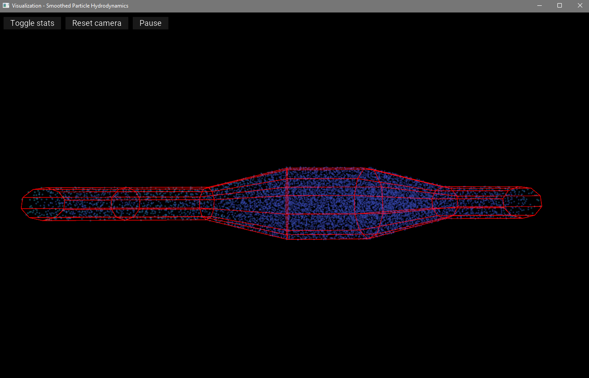

# About
Project is about fluid simulation and basic visualization.
To simulate fluid we used [SPH technique](https://en.wikipedia.org/wiki/Smoothed-particle_hydrodynamics).
This approach assumes that a fluid is a set of particles that interact with each other and move around according to [Navier-Stokes equations](https://en.wikipedia.org/wiki/Navier–Stokes_equations).
Due to the fact that it is a massively parallel task, we use GPU programming with [CUDA](https://developer.nvidia.com/cuda-toolkit).
To make production relatively faster and easier we use Python programming language.

# Setup
Tested with Python 3.9

### Simulator workspace
Install CUDA Toolkit: https://developer.nvidia.com/cuda-toolkit-archive
```sh
cd sim
./venv/Scripts/activate
pip install -r ./requirements.txt
```

### Visualization workspace
Download PyOpenGL manualy from https://www.lfd.uci.edu/~gohlke/pythonlibs/#pyopengl.
```sh
cd vis
./venv/Scripts/activate
pip install ./PyOpenGL-3.1.5-cp39-cp39-win_amd64.whl # cp39 <==> Python 3.9
pip install ./PyOpenGL_accelerate-3.1.5-cp39-cp39-win_amd64.whl # cp39 <==> Python 3.9
pip install -r ./requirements.txt
```

# Usage

Software we made is divided into two programs, simulator and visualizer.
Simulator is able to produce a simulation (to a chosen directory), and visualizer displays it.


### Simulator
Simulation can have two modes: inside a box or a pipe.
File `config.py` is used to set numerous simulation parameters such as mode, particle count or initial state of the simulations.
Running simulator:
```shell
python ./sim/src/main.py
```

### Visualizer
Running visualizer:
```shell
python ./vis/src/main.py
```

#### Movement
- `W,A,S,D` - Move forward, left, back and right (relative to the camera)
- `Q, E` - Move down and up (relative to the camera)
- `Click and drag` - Rotate the camera

#### Demo




# Documentation
Full documentation of the project is available in polish: [Dokumentacja Projektu](docs/Dokumentacja%20projektu%20CUDA-SPH.pdf)